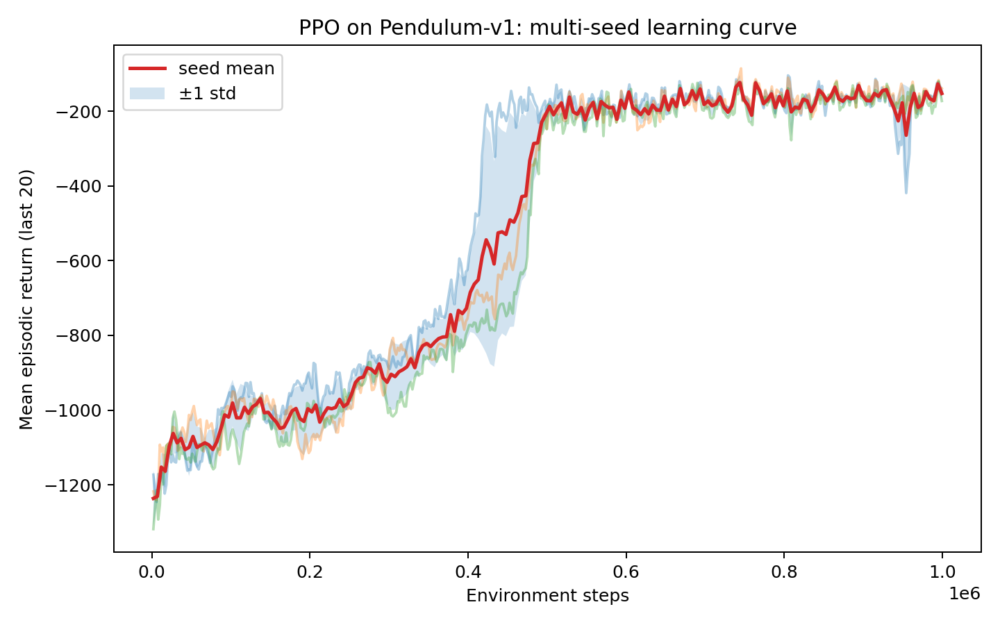
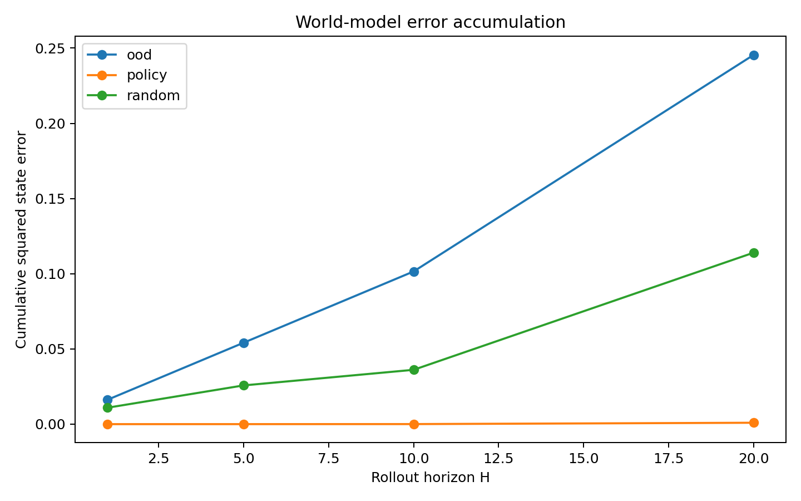
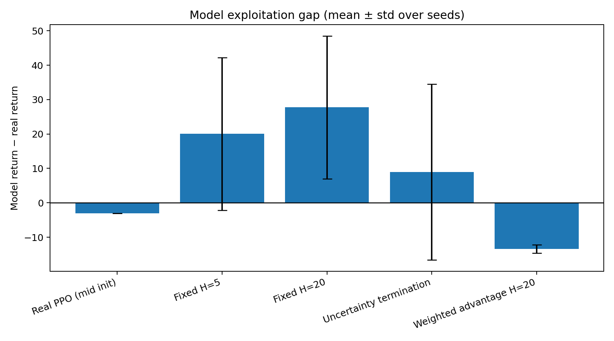

# Reliable Reinforcement Learning under Imperfect World Models

A compact, from-scratch, fully reproducible study of one question in model-based RL:

> **When a policy is optimized *inside* a learned world model, when does it genuinely improve — and when does it merely exploit the model's errors?**

The project builds the whole stack from scratch in PyTorch — continuous-control PPO, a bootstrapped dynamics ensemble, and uncertainty-aware policy refinement inside the learned model — on `Pendulum-v1`, and then measures the **exploitation gap** (how much better a policy looks in imagination than in reality) under matched conditions.

It is deliberately a **state-space, dynamics-model MBRL** study (à la PETS / MBPO / Dreamer's imagination step), **not** a generative video world model (à la Cosmos). The point is the *RL-reliability mechanism* — long-horizon error accumulation, epistemic uncertainty, and policy-induced distribution shift — which is transferable across world-model backbones.

---

## TL;DR — what the experiments show

1. **PPO solves Pendulum from scratch** (3 seeds): deterministic return **−153 ± 4** vs random **−1199**. Getting there required a non-obvious fix — **reward normalization** — without which PPO plateaus at ~−1000 (see [§Phase 1](#phase-1--continuous-control-ppo-from-scratch)).
2. **A dynamics ensemble trained only on expert data is extremely accurate on-distribution and fails off-distribution**, exactly as epistemic-uncertainty theory predicts: one-step MSE **policy 2.0×10⁻⁶ ≪ random 3.0×10⁻³ < OOD 5.2×10⁻³** (≈1500× / 2600×), and ensemble disagreement tracks the same ordering ([§Phase 2](#phase-2--learned-dynamics-ensemble)).
3. **The exploitation gap is real and grows with rollout horizon**, and — the honest headline — **uncertainty calibrated on a narrow distribution does not transfer** to refining an off-distribution policy: it truncates rollouts so aggressively (adaptive horizon collapses 20 → 4.3) that it destroys the learning signal ([§Phase 3–4](#phase-3--policy-refinement-inside-the-world-model)).

The third result is a genuine reliability *failure mode*, analyzed rather than hidden — see [§Key finding](#key-finding-two-regimes-of-model-based-refinement) and [§Limitations & future work](#limitations--future-work).

---

## Table of contents

- [Repository layout](#repository-layout)
- [Setup](#setup)
- [Reproduce everything](#reproduce-everything)
- [Phase 1 — Continuous-control PPO from scratch](#phase-1--continuous-control-ppo-from-scratch)
- [Phase 2 — Learned dynamics ensemble](#phase-2--learned-dynamics-ensemble)
- [Phase 3 — Policy refinement inside the world model](#phase-3--policy-refinement-inside-the-world-model)
- [Phase 4 — The exploitation gap](#phase-4--the-exploitation-gap)
- [Key finding: two regimes of model-based refinement](#key-finding-two-regimes-of-model-based-refinement)
- [Limitations & future work](#limitations--future-work)
- [Scope & honesty statement](#scope--honesty-statement)

---

## Repository layout

```
world_model_rl_complete/
├── ppo_core.py               # shared: actor-critic, tanh-Gaussian policy, eval, device
├── train_ppo.py              # Phase 1: real-environment PPO (+ reward-norm / LR flags)
├── evaluate_ppo.py           # Phase 1: deterministic + random-policy evaluation
├── plot_ppo_results.py       # Phase 1: multi-seed learning curve & eval bars
│
├── collect_transitions.py    # Phase 2: policy / random / OOD transition datasets
├── world_model.py            # Phase 2: 5-member Δ-state dynamics ensemble
├── train_world_model.py      # Phase 2: bootstrap training + uncertainty calibration
├── evaluate_world_model.py   # Phase 2: one-step & multi-step rollout error
│
├── imagined_env.py           # Phase 3: vectorized imagined env (learned dynamics + exact reward)
├── train_imagined_ppo.py     # Phase 3: fixed / uncertainty / weighted refinement
├── compare_imagined_methods.py  # Phase 4: 200-step model-vs-real, same initial states
├── aggregate_comparison.py   # Phase 4: seed-level mean±std aggregation & error-bar plots
│
├── run_pipeline.sh           # end-to-end driver (Phase 1 uses the solved-Pendulum config)
└── runs/, data/              # outputs (figures + CSV/JSON committed; .pt/.npz regenerable)
```

---

## Setup

```bash
python3 -m venv .venv && source .venv/bin/activate
pip install -r requirements.txt          # torch, gymnasium[classic-control], numpy, matplotlib, pandas
```

**macOS + conda note.** If you hit `OMP: Error #15: ... libomp.dylib already initialized`, export this once (already exported inside `run_pipeline.sh`):

```bash
export KMP_DUPLICATE_LIB_OK=TRUE
```

CPU is the default and is fast enough here (~10.5k env-steps/s; a 1M-step PPO seed takes ~90 s). `--device mps` / `--device cuda` are supported.

---

## Reproduce everything

```bash
bash run_pipeline.sh          # Phase 1→4 with the solved-Pendulum PPO config
```

Or run phases individually — every command is in the phase sections below. The exploitation-gap study of Phase 4 has two regimes; the "off-distribution" regime is reproduced in [§Phase 4](#phase-4--the-exploitation-gap).

---

## Phase 1 — Continuous-control PPO from scratch

**Environment.** `Pendulum-v1`: observation $s_t=(\cos\theta_t,\sin\theta_t,\dot\theta_t)$, torque $a_t\in[-2,2]$, reward

$$r_t = -\big(\theta_t^2 + 0.1\,\dot\theta_t^2 + 0.001\,a_t^2\big).$$

**Policy.** A tanh-squashed Gaussian. The network outputs $\mu_\theta(s),\sigma_\theta(s)$; we sample $z\sim\mathcal N(\mu_\theta,\sigma_\theta^2)$ and squash

$$a = a_{\text{scale}}\tanh(z) + a_{\text{bias}}.$$

The change of variables requires a log-det-Jacobian correction to the log-probability:

$$\log\pi_\theta(a\mid s) = \log\mathcal N(z;\mu_\theta,\sigma_\theta^2) - \sum_i \log\!\big(a_{\text{scale}}(1-\tanh^2 z_i)\big).$$

At evaluation we use the deterministic actor mean $a = a_{\text{scale}}\tanh(\mu_\theta(s)) + a_{\text{bias}}$.

**Advantage estimation (GAE-λ).** With $\delta_t = r_t + \gamma V(s_{t+1})(1-d_{t+1}) - V(s_t)$,

$$\hat A_t = \sum_{l\ge 0}(\gamma\lambda)^l\,\delta_{t+l},\qquad \hat R_t = \hat A_t + V(s_t).$$

**Clipped PPO objective.** With ratio $\rho_t(\theta)=\dfrac{\pi_\theta(a_t\mid s_t)}{\pi_{\theta_{\text{old}}}(a_t\mid s_t)}$ and normalized advantages,

$$L^{\text{clip}} = \mathbb E\Big[\min\big(\rho_t\hat A_t,\ \text{clip}(\rho_t,1-\epsilon,1+\epsilon)\hat A_t\big)\Big],$$

plus a clipped value loss and a target-KL early stop. (All implemented in [`train_ppo.py`](train_ppo.py).)

### The non-obvious fix: reward normalization

Out of the box (200k steps, LR annealed to 0, no reward scaling) PPO **plateaus at ~−1000**, barely above random. Diagnosis: unnormalized Pendulum returns are $O(10^3)$, so the critic's `value_loss` is ~2000–4000 → noisy critic → noisy advantages → stalled policy learning. Ablation:

| Config | Result (return) |
|---|---|
| default (200k, anneal→0, ent 0, no norm) | ~−1000 |
| constant LR + `ent-coef 0.01`, **no** reward norm | ~−580 (best) |
| constant LR + `ent-coef 0` | collapses to ~−1000 (no exploration) |
| **constant LR + `ent-coef 0.01` + reward norm** | **−153** ✅ |

`train_ppo.py` adds two flags: `--anneal-lr {0,1}` and `--normalize-reward {0,1}`. Reward normalization wraps **only the training reward** (Gymnasium `NormalizeReward`); observations are untouched, so the saved policy interface — and the entire downstream world-model pipeline — is unaffected. `RecordEpisodeStatistics` (inner wrapper) keeps logged returns on the true environment scale. It drops `value_loss` from ~3000 to ~0.05.

```bash
for seed in 0 1 2; do
  python train_ppo.py --seed $seed --total-timesteps 1000000 \
    --anneal-lr 0 --ent-coef 0.01 --normalize-reward 1 \
    --output-dir runs/ppo_seed$seed --device cpu
done
python evaluate_ppo.py --checkpoints runs/ppo_seed{0,1,2}/checkpoint.pt \
  --episodes 30 --output runs/ppo_summary/evaluation.csv
python plot_ppo_results.py --metrics runs/ppo_seed{0,1,2}/metrics.csv \
  --evaluation runs/ppo_summary/evaluation.csv --output-dir runs/ppo_summary
```

### Results

| Policy | Deterministic return (30 ep) |
|---|---|
| PPO seed 0 | −148.7 ± 94.4 |
| PPO seed 1 | −152.7 ± 100.9 |
| PPO seed 2 | −157.5 ± 100.5 |
| **across seeds** | **−153.0 ± 4.4** |
| random baseline | −1198.6 ± 280.7 |

The learning curve shows the textbook Pendulum shape: a sharp phase transition at ~400–500k steps, then a stable ~−150 plateau across seeds.



Files: [`runs/ppo_summary/evaluation.csv`](runs/ppo_summary/evaluation.csv), `learning_curve_mean_std.png`, `evaluation_bar.png`.

---

## Phase 2 — Learned dynamics ensemble

### What "world model" means here

A **learned state-space dynamics model**: an ensemble of $K=5$ MLPs that predict the **state delta**, not the absolute next state:

$$\hat s_{t+1}^{(j)} = s_t + f_{\theta_j}(s_t,a_t),\qquad \Delta s_t = s_{t+1}-s_t,\quad j=1,\dots,K.$$

Predicting $\Delta s$ (with input/target normalization) is easier and more accurate than predicting $s_{t+1}$ directly. After each model step, the `(cos θ, sin θ)` components are re-projected onto the unit circle, $(\hat c,\hat s)\leftarrow (\hat c,\hat s)/\sqrt{\hat c^2+\hat s^2}$, so long rollouts stay on the valid manifold.

**Three design choices that make the study clean:**

- **No learned reward.** Imagined rollouts use the *exact* Pendulum reward. This isolates any policy exploitation to **dynamics-model error**, not reward-model error.
- **Bootstrap ensemble + episode-level split.** Each member trains on a bootstrap resample $D_j\sim\text{Bootstrap}(D_{\text{train}})$; the train/validation split is by whole episode, so adjacent transitions of one trajectory never straddle the split.
- **Ensemble disagreement = epistemic uncertainty:**

$$u_t = \operatorname{mean}_k \operatorname{Var}_j\big[\hat s_{t+1,k}^{(j)}\big],$$

calibrated on the validation set into quantiles $q_{50},q_{90},q_{95},q_{99}$. Here $q_{95}=6.63\times10^{-6}$ — the default rollout-termination threshold in Phase 3.

### Datasets & the distribution-shift hypothesis

Three datasets are collected from the solved seed-0 policy region and its complement:

| Dataset | Actions | mean reward |
|---|---|---|
| `policy` (60k) | stochastic PPO policy | −0.9 (near-upright, low cost) |
| `random` (30k) | $a\sim U[-2,2]$ | −6.3 |
| `ood` (30k) | extreme torques $\lvert a\rvert\in[0.85,1.0]\,a_{\max}$ | −6.3 |

```bash
python collect_transitions.py --mode policy --checkpoint runs/ppo_seed0/checkpoint.pt --steps 60000 --output data/policy.npz
python collect_transitions.py --mode random --steps 30000 --output data/random.npz
python collect_transitions.py --mode ood    --steps 30000 --output data/ood.npz
python train_world_model.py --datasets data/policy.npz --ensemble-size 5 --epochs 80 --output-dir runs/world_model
python evaluate_world_model.py --checkpoint runs/world_model/world_model.pt \
  --datasets data/policy.npz data/random.npz data/ood.npz --horizons 1,5,10,20 --output-dir runs/world_model_eval
```

### Results — the model is accurate exactly where it was trained

All 5 members early-stop cleanly (val MSE ~2–4×10⁻⁶). Trained **only on `policy` data**, the model's error under distribution shift is dramatic:

| Source | one-step MSE | vs policy | mean ensemble uncertainty |
|---|---|---|---|
| policy | 1.96×10⁻⁶ | 1× | 1.2×10⁻⁶ |
| random | 2.97×10⁻³ | ~1500× | 2.2×10⁻⁴ |
| ood | 5.17×10⁻³ | ~2600× | 3.9×10⁻⁴ |

The multi-step cumulative error $E_H=\frac1H\sum_{h=1}^{H}\lVert\hat s_{t+h}-s_{t+h}\rVert_2^2$ stays flat for `policy` and diverges for `random`/`ood`, with the gap compounding in $H$:



Crucially, **ensemble disagreement rises in the same order** (policy ≪ random < ood), so the uncertainty signal is a usable proxy for where the model can be trusted. Files: [`one_step_results.csv`](runs/world_model_eval/one_step_results.csv), [`rollout_results.csv`](runs/world_model_eval/rollout_results.csv).

---

## Phase 3 — Policy refinement inside the world model

[`imagined_env.py`](imagined_env.py) is a vectorized "imagined environment": at each step the policy acts, the **exact** reward is applied, the ensemble mean gives the next state, and the ensemble variance gives $u_t$. A real PPO checkpoint **warm-starts** the policy — this is RL *post-training* inside a learned model. Four methods:

- **Fixed H=5 / H=20** — imagined rollouts of fixed length. Longer $H$ ⇒ stronger credit assignment but more model-error accumulation.
- **Uncertainty termination** — cut the rollout the moment $u_t>\tau$ (default $\tau=q_{95}$), giving an *adaptive* horizon $H_t=\min\{H_{\max},\ \text{first }t: u_t>\tau\}$.
- **Weighted advantage** — keep full horizon but down-weight uncertain transitions:

$$\tilde A_t = w_t\,\hat A_t,\qquad w_t=\max\!\big(0.02,\ \exp(-\beta\,u_t/\tau)\big).$$

The floor $0.02$ prevents high-uncertainty transitions from contributing exactly zero gradient.

```bash
python train_imagined_ppo.py --world-model runs/world_model/world_model.pt \
  --state-dataset data/policy.npz --init-checkpoint runs/ppo_seed0/checkpoint.pt \
  --method uncertainty --horizon 20 --output-dir runs/imagined_uncertainty   # etc.
```

---

## Phase 4 — The exploitation gap

Short imagined-segment returns are **not** comparable to 200-step episode returns. So every policy is evaluated from the **same initial states** for a common 200-step horizon in both worlds:

$$J_{\text{model}}(\pi)=\tfrac1N\sum_i R^{(i)}_{\text{model}},\quad J_{\text{real}}(\pi)=\tfrac1N\sum_i R^{(i)}_{\text{real}},\quad \textbf{Exploitation Gap}=J_{\text{model}}(\pi)-J_{\text{real}}(\pi).$$

A positive gap means the policy looks better in imagination than in reality — it is exploiting model error.

### Regime A — refine the *in-distribution* (near-optimal) policy

Warm-start from the solved seed-0 policy (the same policy that generated the model's training data), 100k imagined steps.

| Method | Model return | Real return | Exploitation gap | Mean horizon |
|---|--:|--:|--:|--:|
| Real PPO seed 0 | −150.6 | −150.5 | −0.12 | — |
| Fixed H=5 | −293.6 | −295.7 | +2.03 | 5.0 |
| Fixed H=20 | −149.9 | −149.7 | −0.19 | 20.0 |
| Uncertainty | −150.0 | −149.8 | −0.20 | 16.4 |
| Weighted H=20 | −278.9 | −288.6 | +9.75 | 20.0 |

**Reading:** the model is so faithful on its own training distribution that model ≈ real everywhere (gap ≈ 0 for H=20 / uncertainty). There is almost no model error to exploit and no headroom to improve a near-optimal policy — a *degenerate* regime for studying exploitation. ([`runs/comparison/comparison.md`](runs/comparison/comparison.md))

### Regime B — refine an *off-distribution* (sub-optimal) policy

Warm-start instead from a deliberately sub-optimal checkpoint (`ppo_mid`, deterministic ≈ −570), **500k** imagined steps, **3 seeds** per method, against the *same* expert-trained model.

```bash
python train_ppo.py --seed 0 --total-timesteps 400000 --anneal-lr 0 --ent-coef 0.01 \
  --normalize-reward 1 --output-dir runs/ppo_mid            # the mid checkpoint
# 4 methods × 3 seeds, warm-started from ppo_mid, 500k imagined steps → runs/imag2_*
python compare_imagined_methods.py --world-model runs/world_model/world_model.pt \
  --state-dataset data/policy.npz --checkpoints runs/ppo_mid/checkpoint.pt runs/imag2_*/checkpoint.pt \
  --episodes 50 --output-dir runs/comparison_seeds_raw
python aggregate_comparison.py --comparison-csv runs/comparison_seeds_raw/comparison.csv \
  --output-dir runs/comparison_seeds
```

| Method | Real return | Exploitation gap | Mean horizon |
|---|--:|--:|--:|
| mid init (baseline) | −576 | −3 | — |
| Fixed H=5 | −792 ± 249 | **+20 ± 22** | 5.0 |
| Fixed H=20 | −754 ± 105 | **+28 ± 21** | 20.0 |
| Uncertainty | −1473 ± 24 | +9 ± 26 | **4.3** |
| Weighted H=20 | −1462 ± 4 | −13 ± 1 | 20.0 |



**Now the exploitation gap appears** — and it is *largest at H=20* (+28), consistent with more error accumulation over longer imagined rollouts. ([`runs/comparison_seeds/comparison_aggregated.md`](runs/comparison_seeds/comparison_aggregated.md))

---

## Key finding: two regimes of model-based refinement

Putting the two regimes together gives a sharper statement than either alone:

1. **In-distribution refinement is safe but uninformative.** Refining the policy that generated the model's data leaves model ≈ real (gap ≈ 0); there is nothing to exploit and nothing to gain.
2. **Off-distribution refinement exposes the failure modes.** Optimizing a policy the model never saw produces a genuine, horizon-growing exploitation gap under fixed rollouts — *and* the uncertainty machinery, **calibrated on the narrow expert distribution ($q_{95}=6.6\times10^{-6}$), does not transfer**: the mid policy induces uncertainty ~$10^{-5}$ everywhere, so termination fires immediately (adaptive horizon collapses **20 → 4.3**), starving credit assignment, and weighted advantages down-weight nearly every transition. Both "safeguards" therefore *hurt* real return here.

The lesson is not "these methods don't work" but the more precise, more useful one: **a static world model only supports reliable policy improvement within its training distribution, and uncertainty thresholds must be calibrated on the distribution the policy actually visits.** This is precisely *long-horizon error accumulation* + *policy-induced distribution shift* made measurable on a controllable toy.

---

## Limitations & future work

- **World-model coverage.** The decisive fix is to train the ensemble on **broad replay data** (e.g. `policy ∪ random`) and **recalibrate uncertainty** there, so $\tau$ matches the region the policy explores — the standard MBPO/Dreamer setup. Expected outcome: uncertainty-aware methods recover more real return *and* shrink the gap versus naive fixed rollouts. (Scaffolding is in place; this is a ~1-file rerun.)
- **Iterative data collection.** A single static model cannot follow a policy that moves; alternating data collection and model retraining (MBPO-style) is the principled cure for policy-induced shift.
- **Seeds & significance.** Phase 1 uses 3 seeds; Regime B uses 3 seeds with reported std. Regime A is single-seed and should be seeded before drawing quantitative conclusions.
- **Scale.** Everything is a 3-D state space. The *mechanisms* (Δ-dynamics, ensemble uncertainty, imagined refinement, exploitation-gap measurement) transfer to higher-dimensional and pixel/latent world models; the toy makes them cheap to isolate and inspect.

---

## Scope & honesty statement

This is a **focused reproduction / mechanism study**, built from scratch to understand *how policy optimization stays reliable under an imperfect learned model*. It is a state-space dynamics-model MBRL project, **not** a generative or video world model, and the results — including a safeguard that fails to transfer off-distribution — are reported as measured. Findings that did not go the "expected" way are analyzed in [§Key finding](#key-finding-two-regimes-of-model-based-refinement) rather than omitted.

**Concepts reproduced:** PPO (Schulman et al., 2017), GAE (Schulman et al., 2016), probabilistic dynamics ensembles / PETS (Chua et al., 2018), model exploitation & MBPO (Janner et al., 2019), imagined-rollout policy learning / Dreamer (Hafner et al., 2020).
